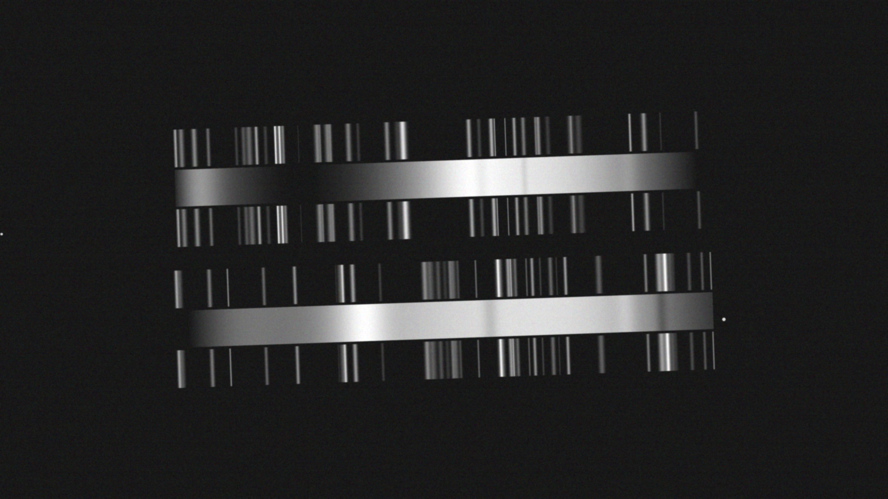
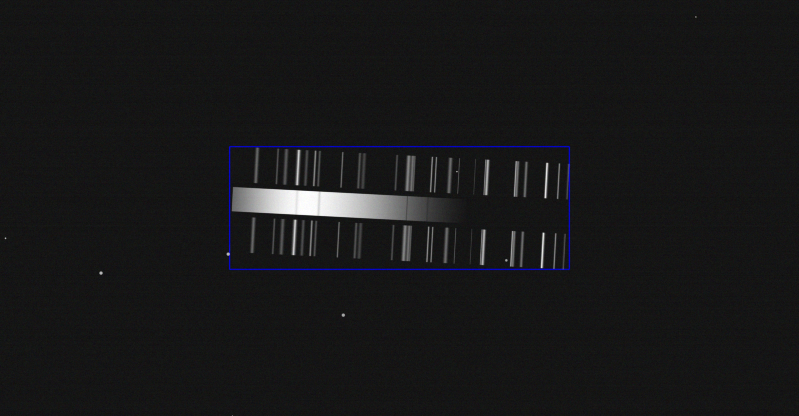
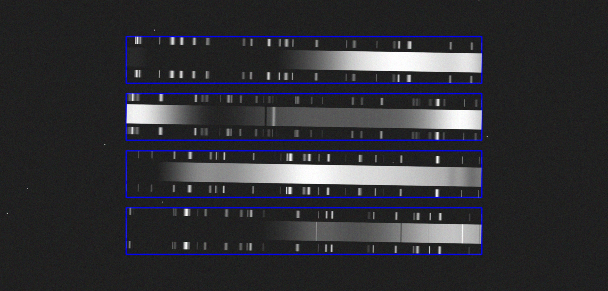

# GSSSP

GSSSP (Generator of Synthetic Scans of Spectroscopic Plates) es un conjunto de herramientas para la generacion de imagenes sinteticas de escaneos de placas espectroscopicas.

De cada imagen generada se provee tanto la imagen como la informacion de los elementos que contiene haciendo las imagenes adecuadas para flujos de trabajo con modelos de vision por computadora como YOLO.







## Entorno virtual

Se recomienda usar un entorno virtual para manejar las dependencias de la libraria de generación.

🔨 Crear entorno virtual `.\venv`:

```
python -m venv venv
```

🚀 Activar entorno virtual `.\venv`:

```
.\venv\Scripts\Activate.ps1
```

## Dependencias

📦 Instala las dependencias neceasrias con:

```
pip install -r requirements.txt
```

## Generar

La carpeta contiene un archivo `main.py` que contiene el código experimental para la generación automática de imágenes de observaciones.

```
python -m main
```

Cada imagen producida tiene un archivo de etiquetas con información de los límites de la imagen que definen cada observación individual y los espectros de ciencia y/o de lámparas de comparación que haya en la misma.

### Compatible con TensorFlow.

En `generators\spectrumLabeledSequence` se encuentra un generador compatible con la librería TensorFlow. El archivo `generator_use_example.py` muestra un ejemplo de como usarla para generar y almacenar archivos, este puede ser usado como se muestra a continuacion. 

```
python -m generator_use_example
```

Su propósito es ser usada como alimentador dentro de la función **fit()** de TensorFlow.

Los datos generados por la misma siempre son redimensionados a una dimensión objetivo (se puede especificar). No obstante, si se quieren imágenes sin redimensionar la opción anterior es la correcta.


## Libreria de generación

`observationArtist.py` encapsula funciones utiles para el dibujado de observaciones en archivos.
