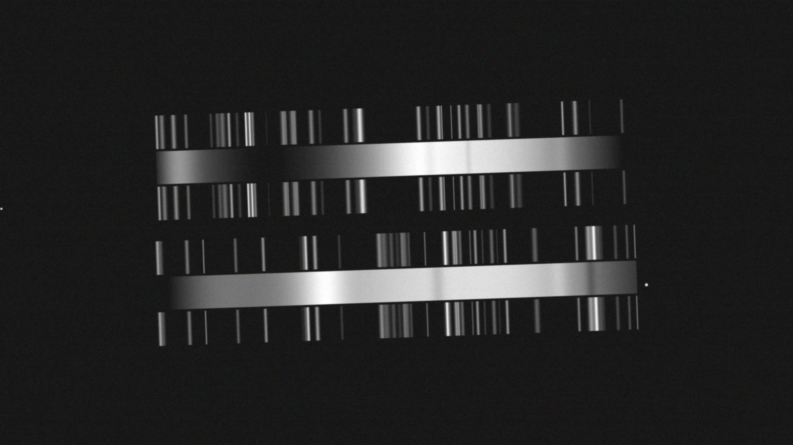
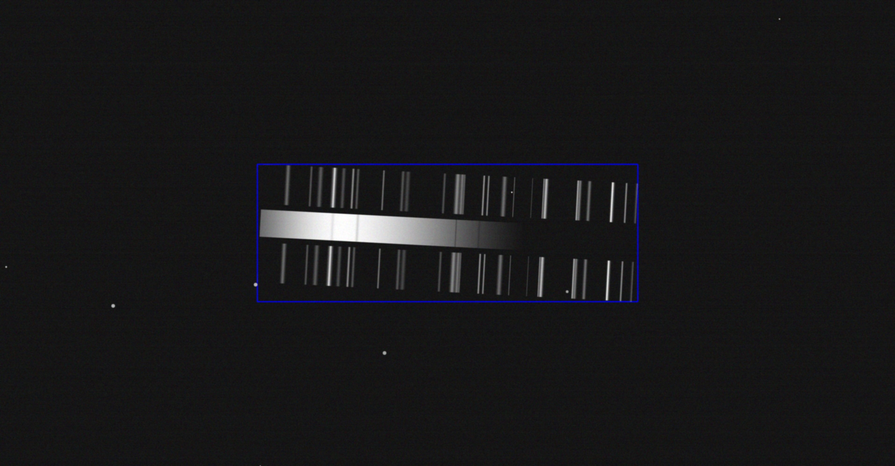
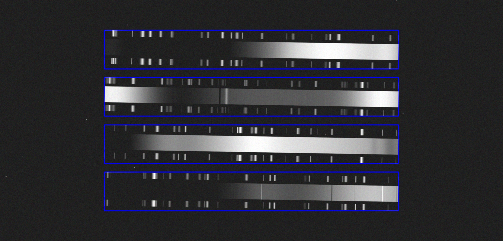

# GSSSP

GSSSP (Generator of Synthetic Scans of Spectroscopic Plates) es un conjunto de herramientas para la generación de imágenes sintéticas de escaneos de placas espectroscópicas.

De cada imagen generada se provee tanto la imagen como la información de los elementos que contiene haciendo las imágenes adecuadas para flujos de trabajo con modelos de visión por computadora como YOLO.








# Entorno virtual

Se recomienda usar *uv* para la administración del entorno virtual.

## Generar

La carpeta contiene un archivo `main.py` que contiene el código experimental para la generación automática de imágenes de observaciones.

```
uv run main.py
```

Cada imagen producida tiene un archivo de etiquetas con información de los límites de la imagen que definen cada observación individual y los espectros de ciencia y/o de lámparas de comparación que haya en la misma.

### Compatible con TensorFlow.

En `generators\spectrumLabeledSequence` se encuentra un generador compatible con la librería TensorFlow. El archivo `generator_use_example.py` muestra un ejemplo de como usarla para generar y almacenar archivos, este puede ser usado como se muestra a continuación. 

```
uv run generator_save_images_example.py
```

Su propósito es ser usada como alimentador dentro de la función **fit()** de TensorFlow. El archivo `generator_fit_example.py` muestra un ejemplo de como conectarlo con un modelo de detección. Se puede ejecutar con el siguiente comando.

```
uv run generator_fit_example.py
```

Los datos generados por la misma siempre son redimensionados a una dimensión objetivo (se puede especificar). No obstante, si se quieren imágenes sin redimensionar la opción anterior es la correcta.


## Librería de generación

`observationArtist.py` encapsula funciones útiles para el dibujado de observaciones en archivos.
